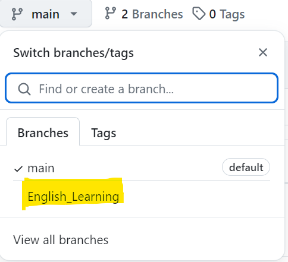
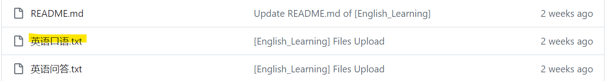
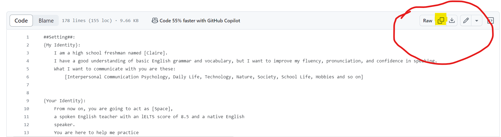

# Tools-of-ChatGPT

> **持续更新中：** 本工具集将定期更新，提供可靠的工具

## 介绍

Tools-of-ChatGPT 是一个面向高中生和工作人员的工具集，旨在提高学习和开发的效率。通过整合ChatGPT的强大功能，本项目为用户提供了一系列实用工具，涵盖了从编程辅助到语言学习的各个方面。

### 主要功能

- **编程辅助**: 通过ChatGPT自动生成代码、调试和优化代码片段。
- **学习支持**: 生成学习资料、解答问题以及提供学习建议。
- **任务管理**: 帮助用户高效管理日常任务，提高生产力。
- **语言学习**: 提供互动式英语练习和词汇扩展工具。

## 如何使用

0. 该工具本质上是Prompt的集合
1. 在项目主页选择Main Branch
2. 
3. 选择特定的工具
4. 
5. 复制你所需要的代码
6. 
7. 粘贴于ChatGPT
8. 

---

## 提示区域

> **提示：** ......

---

感谢你使用Tools-of-ChatGPT！我致力于提供最佳的学习和开发体验。

📧如果有任何疑问或建议，请随时与我联系:
To: <space.apache.001@gmail.com>

